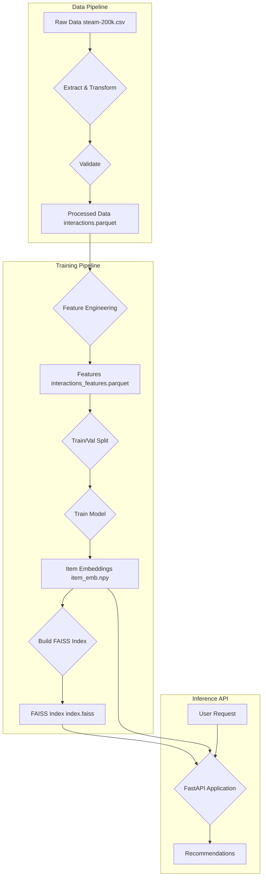

# Steam Game Recommender

This project contains a complete pipeline for building a game recommender system using the Steam 200k dataset. The pipeline is divided into three main stages:

1.  **Data Pipeline**: Extracts, transforms, and validates the raw data.
2.  **Training Pipeline**: Trains a two-tower recommendation model and creates a FAISS index for efficient similarity search.
3.  **Inference API**: Serves recommendations through a FastAPI application.

## Pipeline Overview



## How to run the full pipeline

### Prerequisites

-   Docker
-   Docker Compose

### 1. Get the data

1.  Download the Steam 200k dataset from Kaggle: [https://www.kaggle.com/tamber/steam-video-games](https://www.kaggle.com/tamber/steam-video-games)
2.  Place the `steam-200k.csv` file in the `data/raw` directory.

### 2. Build and run the services

You can build and run all the services (data pipeline, training, and API) with a single command:

```bash
docker-compose up --build
```

This command will:
1.  Build the Docker image.
2.  Run the data pipeline (`pipeline` service).
3.  Run the training pipeline (`trainer` service).
4.  Start the inference API (`api` service).

The API will be available at `http://localhost:8000`.

## Dashboard

This project also includes an interactive dashboard built with Streamlit to easily get recommendations.

To run the dashboard, first make sure the main services are running (`docker-compose up --build`). Then, in a separate terminal, run the following command:

```bash
docker-compose -f docker-compose.dashboard.yml up --build
```

The dashboard will be available at `http://localhost:8501`.

## Running stages individually

You can also run each stage of the pipeline individually.

### Data Pipeline

To run only the data pipeline:

```bash
docker-compose run --rm pipeline
```

**Output:**

-   `data/processed/interactions.parquet`
-   `data/lookups/user_lookup.parquet`
-   `data/lookups/item_lookup.parquet`
-   `data/reports/ingest_report.json`
-   `data/reports/validation_report.json`
-   `data/features/interactions_features.parquet`

### Training Pipeline

To run the training pipeline (after the data pipeline has been run):

```bash
docker-compose run --rm trainer
```

**Output:**

-   `artifacts/item_emb.npy`: Item embeddings.
-   `artifacts/index.faiss`: FAISS index for item embeddings.
-   `artifacts/metrics.json`: Evaluation metrics.

### Inference API

To start the inference API (after the training pipeline has been run):

```bash
docker-compose up api
```

The API will be available at `http://localhost:8000`. You can see the API documentation at `http://localhost:8000/docs`.

### Dashboard

To start the dashboard (after the API is running):

```bash
docker-compose up dashboard
```

The dashboard will be available at `http://localhost:8501`.

## API Endpoints

-   `GET /health`: Health check endpoint.
-   `POST /recommend`: Recommends games.

**Example request for `/recommend`:**

```json
{
  "game_ids": [1, 2, 3],
  "top_k": 10,
  "exclude_seen": true
}
```
